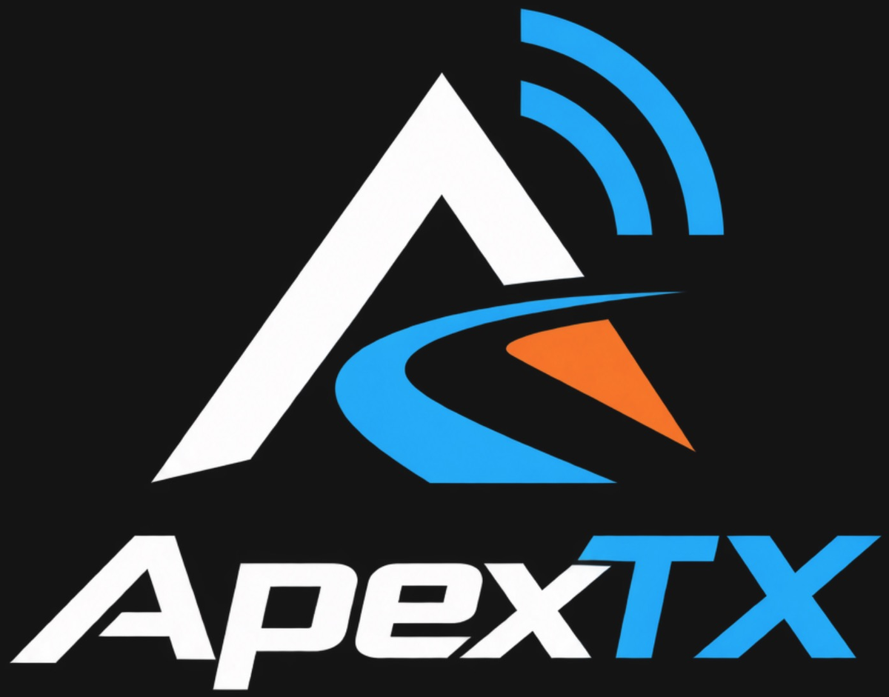
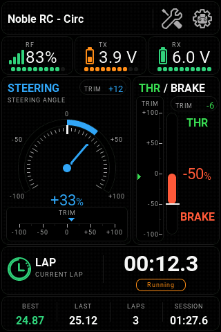
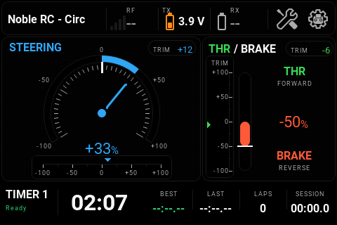
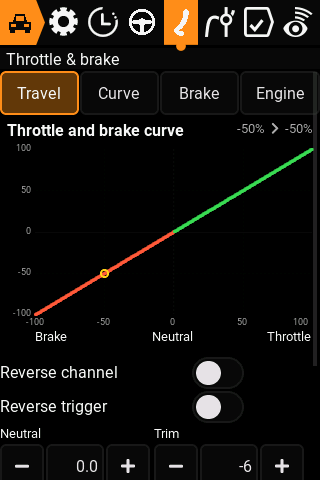
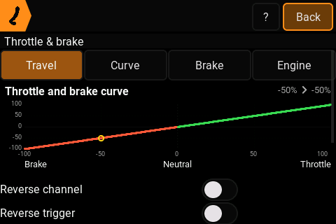
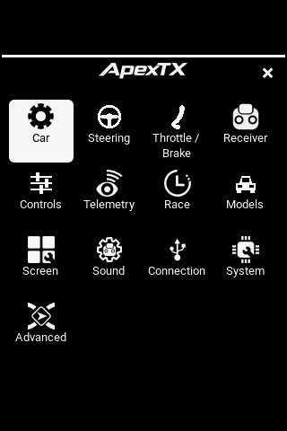
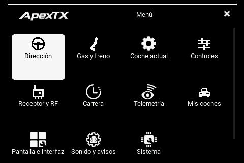

# ApexTX

<p align="center">
  
</p>

[](https://github.com/GastonGelhorn/apextx/actions/workflows/ci.yml)
[](LICENSE)

ApexTX is independent firmware for the original FlySky Noble NB4 transmitter.
It adds a car-focused interface, responsive steering and
throttle controls, configurable hardware assignments, AFHDS3 receiver support,
race timing, telemetry, audio, and an expanded on-device filesystem.

The current project version is **0.1.0-alpha.1**, based on EdgeTX **2.12.4**.

## Features

The original Noble NB4 build includes:

- Full-color dark and light themes designed for the NB4 display.
- Portrait and landscape layouts with the same controls and information in
  both orientations.
- A live racing home with steering, throttle and brake, trims, lap timing, RF
  signal, and TX/RX battery status visible at a glance.
- Direct car setup for steering travel, throttle and brake curves, channel
  limits, ABS, failsafe, telemetry, and receiver binding.
- Detect-and-assign configuration for the wheel, trigger, grip buttons,
  switches, trims, interface navigation, and racing actions.
- Integrated lap timing, history, pit tools, spoken alerts, USB modes, and
  English or Spanish sound packs.
- A maintained, testable firmware base that can absorb selected upstream
  improvements while keeping the NB4-specific interface and AFHDS3 support.

## Interface preview

| Portrait home | Landscape home |
| --- | --- |
|  |  |

| Throttle and brake curve: portrait | Throttle and brake curve: landscape |
| --- | --- |
|  |  |

| Settings modal: portrait | Settings modal: landscape |
| --- | --- |
|  |  |

See the [complete interface gallery](docs/nb4/GALLERY.md) for vehicle setup,
race timing, telemetry, and physical-control assignments.

The currently supported target is the original Noble NB4:

```text
PCB=PL18
PCBREV=NB4
```

The NB4+ target currently compiles as an experimental port candidate. It has
not been validated on hardware. NB4 Pro and NB4 Pro+ require separate board
ports and are not supported. See the [Noble compatibility and feature
matrix](docs/nb4/COMPATIBILITY.md).

## Before you install

ApexTX is unofficial firmware. It is not made by, endorsed by or supported by
FlySky, and installing it replaces the factory firmware on the transmitter.

Read this before flashing anything:

- **There is no warranty.** The GNU GPL version 2 under which this is published
  disclaims one explicitly, and that is not a formality here. You are
  responsible for what happens to your radio and to your car.
- **You can leave the radio needing recovery.** An interrupted first
  installation is recovered through the STM32 ROM DFU, which means opening the
  case to reach an internal button. Back up the original contents first, as
  [FLASH.md](docs/nb4/FLASH.md) describes.
- **The RF setup carries no vendor qualification.** The AFHDS3 settings this
  firmware uses are not covered by any FlySky specification or approval. They
  work on the radios ApexTX has run on, and that is the extent of the claim.
- **Nobody certifies the release binaries.** The archives attached to a release
  are built by GitHub Actions from the tagged source and nothing more. There is
  a hardware checklist in the documentation, but no automated step enforces it,
  so treat a release as a build that compiled and passed its automated tests.
- **Check what you are allowed to transmit.** Radio regulations differ by
  country. Complying with the ones that apply to you is your responsibility.
- **Test before you drive.** Check failsafe with the wheels off the ground,
  every time you change firmware or rebind.

## Project status

The firmware is under active development and is tested on an original Noble
NB4. The maintained configuration uses the USART6 AFHDS3 route and
English firmware strings; English and Spanish voice packs can coexist on the
expanded storage volume.

Device-specific factory images, calibration data, OTP contents, and local build
artifacts are intentionally excluded from this repository.

## Build

The short form of the verified device build is:

```sh
cmake -S . -B build/nb4-device \
  -DPCB=PL18 -DPCBREV=NB4 -DCMAKE_BUILD_TYPE=Release \
  -DPython3_EXECUTABLE="$PWD/.venv/bin/python" \
  -DNB4_RF_PROFILE=RECOVERED_USART6 \
  -DTRANSLATIONS=EN -DDISABLE_COMPANION=ON
cmake --build build/nb4-device --target firmware-size -j8
```

See the maintained NB4 documentation for environment setup, flashing, hardware
details, and validation:

- [NB4 overview](docs/nb4/README.md)
- [Interface gallery](docs/nb4/GALLERY.md)
- [Noble model compatibility](docs/nb4/COMPATIBILITY.md)
- [Build instructions](docs/nb4/BUILD.md)
- [Install from the FlySky firmware](docs/nb4/FLASH.md)
- [Update an existing ApexTX installation](docs/nb4/UPDATE.md)
- [Hardware notes](docs/nb4/HARDWARE.md)
- [Validation checklist](docs/nb4/VALIDATION.md)
- [Control latency](docs/nb4/LATENCY.md)
- [Hardware checklist before a release](docs/nb4/rf/BENCH_ACCEPTANCE.md)
- [Release process](docs/nb4/RELEASE.md)
- [Contributing](CONTRIBUTING.md)
- [Security policy](SECURITY.md)
- [Support](SUPPORT.md)
- [Changelog](CHANGELOG.md)

## Upstream relationship

This project retains the EdgeTX source layout so upstream releases can be
integrated with a reviewable diff. Changes specific to the Noble NB4 are kept in
the NB4 target, interface, protocol, tests, documentation, and tooling wherever
possible.

ApexTX is an independent community project. It is not an official FlySky
or EdgeTX release.

## License

This repository is derived from [EdgeTX](https://github.com/EdgeTX/edgetx) and
is distributed under the GNU General Public License version 2. See
[LICENSE](LICENSE). Existing copyright and attribution notices remain with
their respective authors.
