# Interface gallery

These images are rendered by the native LVGL test target from the same source
used to build the radio firmware. The model, controls, lap times, receiver
voltage, and telemetry values are deterministic simulated data. No layout is a
separate design mockup.

## Racing home

| Portrait | Landscape |
| --- | --- |
|  |  |

The selectable ApexTX Racing layout keeps steering, throttle and brake, trims,
RF status, both batteries, and race timing visible together. Its four instrument
zones are editable; navigation and status indicators remain fixed. It can rotate
at runtime without changing the model.

These Home captures intentionally have no receiver connected. Missing RF and
receiver-battery readings are shown explicitly rather than filled with defaults.

## Home editing and display

| Screens list | Home editor |
| --- | --- |
| 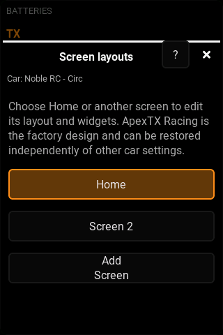 | 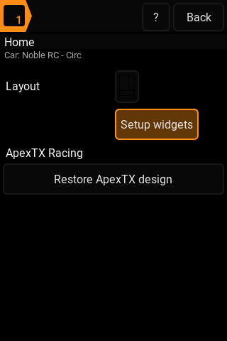 |

| Editable zones | Appearance |
| --- | --- |
| 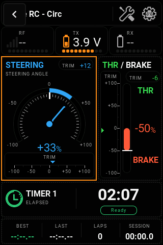 | 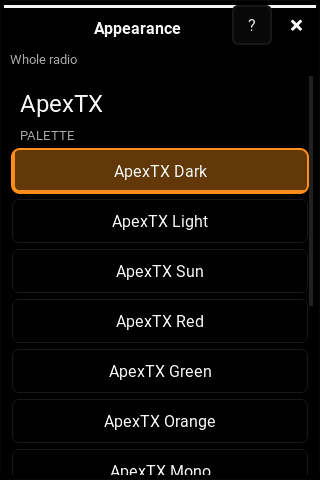 |

Home always opens its own editor, even while another screen is visible.
Restore ApexTX design asks for confirmation and affects only that screen.

## Context and personalization

| Quick-access configuration | Help index |
| --- | --- |
| 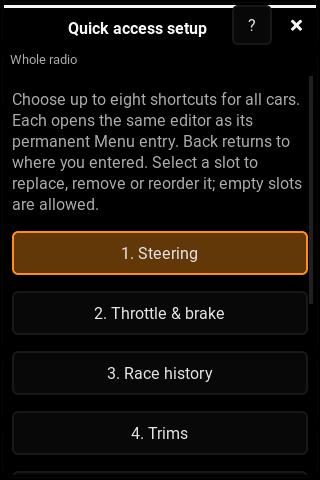 | 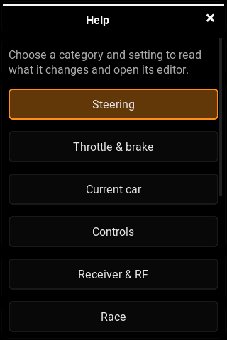 |

| Templates in Spanish | Shared curve in Spanish |
| --- | --- |
| 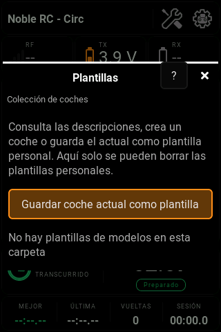 | 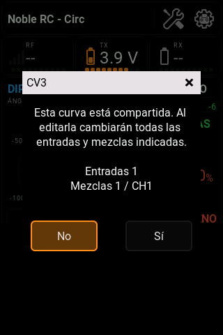 |

## Vehicle setup

| Steering | Throttle and brake |
| --- | --- |
| 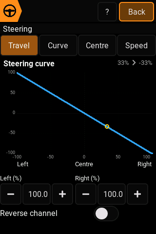 |  |

Travel, direction, centre, speed, curves, brake behaviour, and engine controls
are grouped around the two primary axes of a surface transmitter.

## Current car, startup checks and receiver/RF

| Car details | Startup checks with inline explanations (Spanish) |
| --- | --- |
| 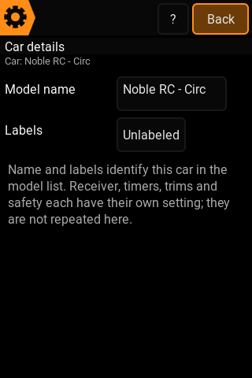 | 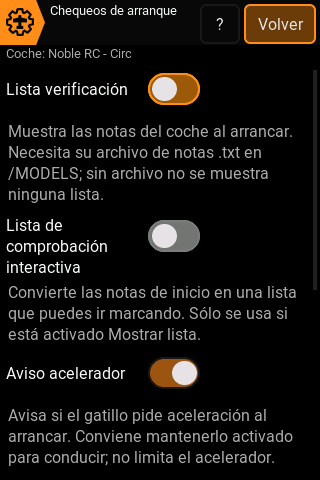 |

| Vehicle presets (Spanish) | Race setup (Spanish) |
| --- | --- |
| 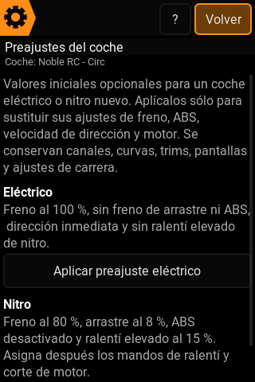 | 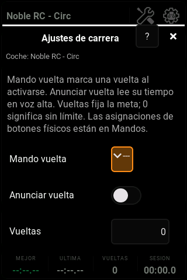 |

| Receiver | Receiver header help |
| --- | --- |
| 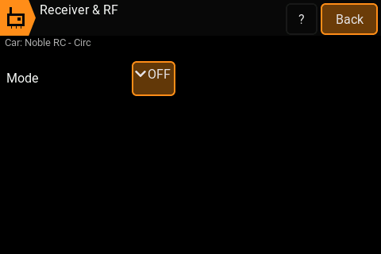 | 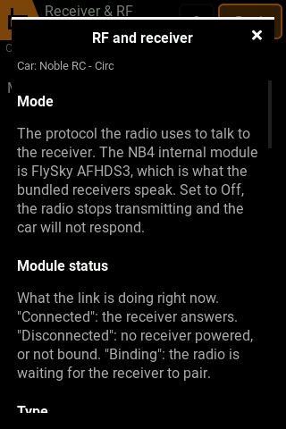 |

General is now Car details; Starting point is now Vehicle presets. Receiver,
timers, trims and startup checks are not repeated in Car details. A preset is optional
and requires confirmation. The ? control is in the header; closing help returns
to the same editor, and decorative icons do not act as hidden Back buttons.

## Throttle and brake curve

| Portrait | Landscape |
| --- | --- |
|  |  |

The same response curve and live input marker adapt to both orientations. Gas
and brake keep independent travel and direction controls around a shared
neutral point.

## Racing and telemetry

| Timers and laps | Live telemetry |
| --- | --- |
| 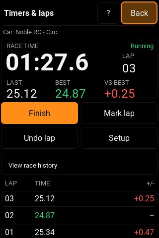 | 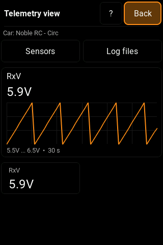 |

Lap timing includes the current run, best and last laps, delta, undo, pit
tracking, and persistent history. Telemetry pages show live values and graphs
for sensors reported by the receiver.

## Navigation and assignments

| Menu | Physical controls |
| --- | --- |
|  | 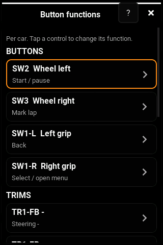 |

The Menu hierarchy is organised for car use. Physical buttons,
switches, and four-way trims can also be assigned by choosing an action and
pressing the desired control.

## Menu and quick access

| Menu: portrait | Quick access: portrait |
| --- | --- |
|  | 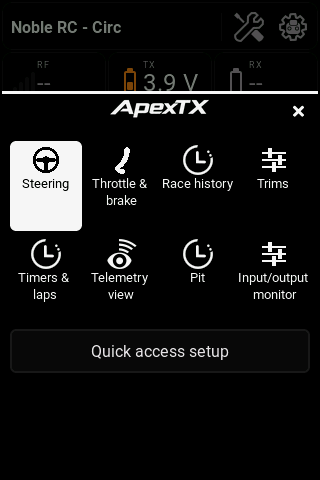 |

| Menu: landscape | Quick access: landscape |
| --- | --- |
|  | 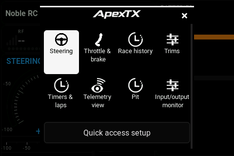 |

The two main modal headers use the compact ApexTX wordmark. Section titles and
touch targets remain consistent in both layouts, and the grids reflow without
clipping their labels.
Navigation grids omit the ? button; contextual help remains in editors, and
the complete index is available in System > Help.
Quick access opens the same editor without hiding its permanent Menu entry.
Steering and Throttle/brake open their editor directly, without a grid of tabs.
The default race-oriented set uses Pit; existing Receiver shortcuts are retained.

## Stable menu review

| Display & interface | Race order and reset separator |
| --- | --- |
| 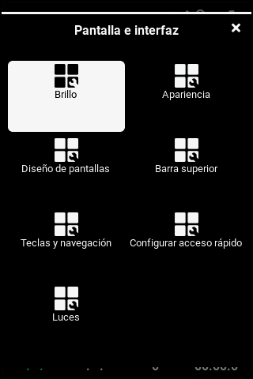 | 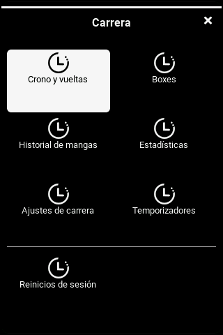 |

| Navigation buttons, saved per car | Usage statistics, mixed radio/session data |
| --- | --- |
| 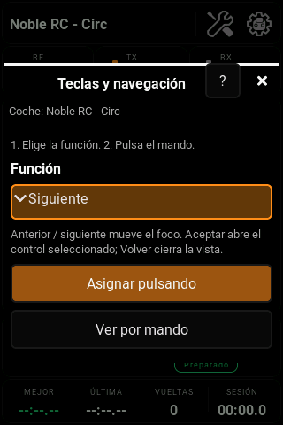 | 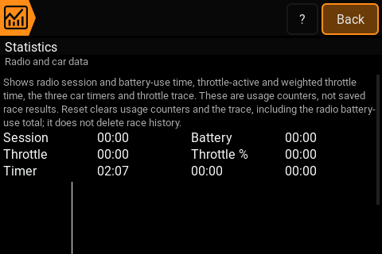 |

| Manual backup | Separate scoped resets |
| --- | --- |
| 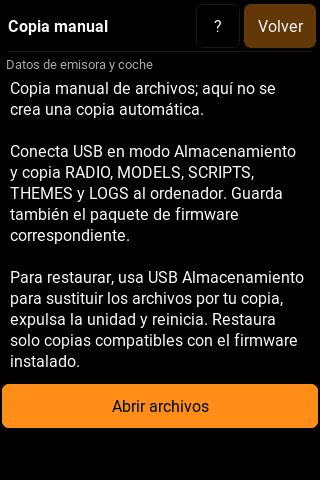 | 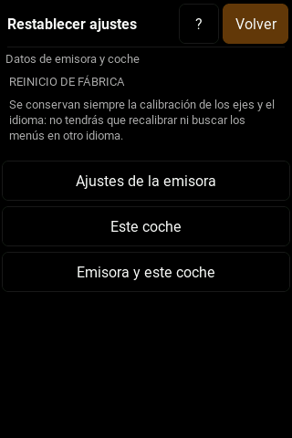 |

Scope stays visible below the header. Wide submenu tiles avoid splitting long
names; compact root/quick-access grids retain their existing arrangement.

## Regenerating the images

The gallery must stay tied to a tested build. Generate the source frames with:

```sh
mkdir -p build/nb4-gallery
NB4_SCREENSHOT_DIR="$PWD/build/nb4-gallery" \
  build/nb4-device/native/gtests-radio \
  --gtest_filter='Nb4Ux.RacingHomeIsARealFourZoneLayoutWithIndependentScreenEditors:Nb4Ux.EveryAvailableRouteActuallyOpensSomethingAndComesBack:Nb4Ux.HeaderHelpReturnsToItsOwnerAndDoesNotCreateDuplicateEditors:Nb4Ux.RouteScopesAndNavigationOnlyEditorInBothLanguagesAndOrientations:Nb4Ux.MenuTilesHaveLegibleFirstFrameFocusAndFitLongNames:Nb4Ux.ContextualCurveEditorListsSharedInputsAndMixes:Nb4Ux.AssignmentsAreReadableAndSaveOnlyWhenRequested:Nb4RacingUi.AllDestinationsAndEditorsInBothLanguagesAndOrientations'
```

The tests write lossless PPM framebuffer captures. Convert only the selected
English and Spanish `ApexTX Dark` frames to the PNG files in `docs/nb4/images`
and inspect them before committing.
